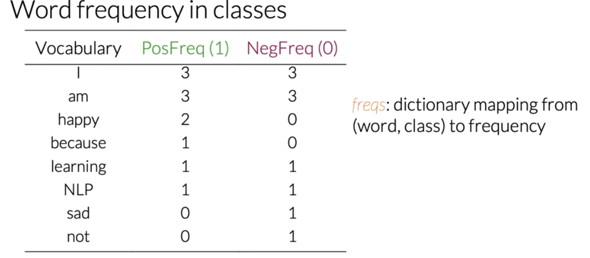
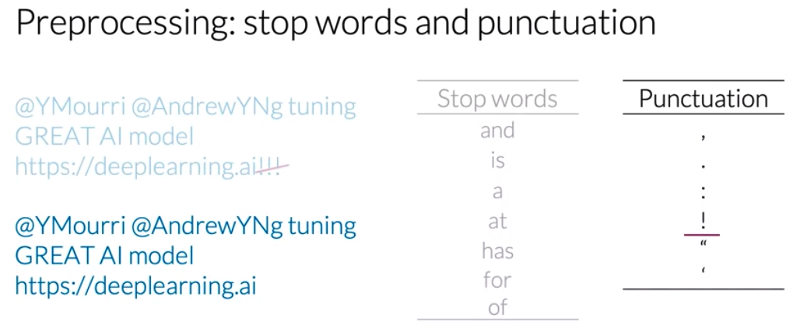

# Sentiment Analysis with Logistic Regression 

**NOTE:**

This repository is based on week 1 of **Natural Language Processing with Classification and Vector Spaces** course on Coursera. Figures below credits goes to the course copy right. 

**Final Project Here**: [Click Link](https://github.com/KarenJF/deeplearing_nlp/blob/master/c1_nlp_classification_vec_spaces/week1/C1_W1_Assignment.ipynb)

## Part 1: Sentiment Analysis with Logistic Regression 
In this folder, I used logistic Regression on tweets to do sentiment analysis, aka identify positive tweets vs. negative tweets. 

### 1. Supervised ML (Training)
In supervised machine learning we have input features X and a set of labels Y. Now to make sure we're getting the most accurate predictions based on our data, our goal is to minimize the error rates or cost as much as possible. 
- We use the features X to run through our prediction function. 
- We run the prediction function which takes in parameters data to map the features X to output Y hat. 
- The best mapping from features to labels is achieved when the difference between the expected values Y and the predicted values y hat is minimized, which the cost function does by comparing how closely the output Y hat is to target Y. 
- We update the parameters and repeat the whole process until the cost is minimized. 

  

### 2. Sentiment Analysis 
According to Wikipedia, "**Sentiment analysis** (also known as opinion mining or emotion AI) refers to the use of natural language processing, text analysis, computational linguistics, and biometrics to *systematically identify, extract, quantify, and study affective states and subjective information*."

A simple example is: 
- Given a tweet: "I am happy because I am learning NLP."
- The **goal** is to predict whether this tweet is possitive or negative. 

**The question is how do we predict whether the tweet is positive or negative?**

- **Approach**: Positive or Negative, this seems like a binary classification problem. In Machine Learning, we don't always need to use fancy deep learning technique. Instead, if we can extract **simple but useful** information from the text using NLP techique, **we can build a simple logistic regression model to identify positive or negative tweet fairly accurately**. 

  

Steps we can take are: 
- First we will process the raw tweets in the training sets to extract useful features.
- Then we will train the logistic regression classifier while minimizing the cost. 
- Finally we'll be able to make the predictions. 

  

### 3. Vocabulary & Feature Extraction
**Motivation**: Since we know computer works with numbers and texts are not numbers. Before we jump into extracting features from tweets, we need to think about **how do we represent a text in computer**?

In order to represent a text as a vector, we first have to build a vocabulary and that will allow us to encode any text or any tweet as an array of numbers. 

#### Vocabulary
**Definition:** Given a list of text, the vocabulary V would be the list of unique words from the list of text we have. 
- To get that list, one approach we can use is: go through all the words from all the texts and save every new word that appears in the search. 

  

#### Feature Extraction
To extract features from the vocabulary, we’d have to check if every word from the vocabulary appears in the text. 
- If it does, then we would assign a value of 1 to that feature. - If it doesn’t, then assign a value of 0. 

**This type of representation with a small relative number of non-zero values is called a sparse representation.**

For an example, the representation of our sample text would have a couple ones and many zeros. These correspond to every unique word from the vocabulary that isn't in the tweet. 

  

**Problem**: \
With this approach, we immediately see some problems: 
- This representation would have **a number of features equal to the size of the entire vocabulary**. 
- This would have **a lot of features equal to 0** for every tweet. 
- With the sparse representation, a logistic regression model would have to **learn n plus 1 parameters**, where n would be equal to the size of the vocabulary. *We can imagine that for large vocabulary sizes, this would be problematic.* 

  

As we can see above, as V gets larger, the vector becomes more sparse. Furthermore, we end up having many more features and end up training θV parameters. This could result in larger training time, and large prediction time. In summary: 
- It would take an excessive amount of time to train your model
- It takes much more time than necessary to make predictions.

**Is there a better way to extract useful features from text?** 

### 4. Negative and Positive Frequencies
There are many creative ways to create features from text. One approach is to get the positive and negative frequencies. 

#### Positive and Negative counts
**Purpose:** we can learn to generate counts as features into the logistic regression classifier. 
- Specifically, given a word, we want to keep track of the number of times that it shows up as the positive class or negative class. 
- Using both those counts, we can extract features and use those into logistic regression classifier. 

The steps to get the counts: 
- Have a set of corpus in the training dataset. Associated with that corpus, we would have a set of unique words - the vocabulary. 
- For sentiment analysis, let’s say we have two classes in this case - positive or negative. 
- For each class, to get the frequency in each class in any word in our vocabulary, we will have to count the times as it appears in that class. Please note, we do not count it in the whole training set. 

Here is an example of **positive tweet words frequency**: 

  

Here is the example of **negative tweet words frequence**: 

  

**In summary**: Below is the look of the word frequency in each class. In practice, this table is a dictionary mapping from a word class to its frequency. So it maps the word and its corresponding class to the frequency or the number of times that's where it showed up in the class. 

  

### 5. Feature Extraction with Frequencies
Previously, we mention we extract features based on the V vocabulary, which means our logistic regression would need to learn V features. This would be problematic when V is getting large. 

We can reduce the V dimension by **representing a word as a vector of dimension 3 using the frequency table we created**. In doing so, we’ll have much faster speed for the logistic regression classifier, because instead of learning V features, we only have to learn 3 features. 

#### Feature Extraction with 3 Dimension Vector 
We can extract feature to represent a tweet as: 
- A bias term
- The sum of positive frequencies for the words from the vocabulary that appear on the tweet.
- The sum of negative frequencies of the words from the vocabulary that appear on the tweet. 

So to extract the features for this representation, we'd only have to sum frequencies of words. 

  

#### Let's see this in an example: I am sad, I am not learning NLP
- Get the sum of positive frequencies = 8

  

- Get the sum of negative frequencies = 11

  

- Therefore, in this example, the tweet can be represented as: 

  

### 6. Preprocessing
**Motivation**: Before we start to build out any models for NLP projects, a vast majority of the time is to preprocess the text to make it clean in order to be able to extract valuable features from it. 

There are some common steps we would do to clean the text. 

#### A. Preprocessing: Stop Words and Punctuation
- Remove all the words that don't add significant meaning to the tweets, aka stop words and punctuation marks. In practices, we would compare our tweet against two lists - stop words and punctuation. These lists are usually much larger. 
    - The overall meaning of the sentence after stop words removal could be inferred without any effort.
    - Note that in some contexts we won't have to eliminate punctuation. So we should think carefully about whether punctuation adds important information to the specific NLP task or not.

  

#### B. Preprocessing: Handles and URLs
- Tweets and other types of texts often have handles and URLs, but these don't add any value for the task of sentiment analysis so we can eliminate them as well. 

  

#### C. Preprocessing: Stemming and lowercasing
- **Stemming**: Stemming in NLP is simply transforming any word to **its base stem**, which we could define as the set of characters that are used to construct the word and its derivatives. **So the vocabulary would be significantly reduced when we perform this process for every word in the corpus.** 
- **Lowercasing**: To reduce your vocabulary even further without losing valuable information, you'd have to lowercase every one of your words.

After this, our tweet would be preprocessed into a list of words [tun, great, ai, model]. Below we can see how we eliminated handles, tokenized it into words, removed stop words, performed stemming, and converted everything to lowercase. 

  

**In summary**, when preprocessing, we usually perform the following:
- Eliminate handles and URLs
- Tokenize the string into words.
- Remove stop words like "and, is, a, on, etc."
- Stemming or convert every word to its stem. Like dancer, dancing, danced, becomes 'danc'. You can use porter stemmer to take care of this.
- Convert all words to lowercase.

### 7. Putting it all together
Previously, we discuss 
- The approach (use logistic regression) to preform sentitment analysis.
- Extract useful features to represent tweets
- Common steps to preprocess the text before building the model. 

In this section, we **summarize them and put it all togehter**.\
- **Preprocess**: For each tweet, we preprocess the tweet into a list of words that contain all the relevant information. 
- **Create dictionary**: With that list of words, we would be able to get a nice representation using a frequency dictionary mapping. 
- **Extract features**: Finally, get a vector with a bias unit and two additional features that store the sum of the number of times that every word on the process tweets appear in positive tweets and the sum of the number of times that every word on the negative ones. 

  

In practice, we would have to perform this process on a set of m tweets.

  

At the end we would have a matrix, X with m rows and three columns where every row would contain the features for each one of the tweets.

  

## Part 2: Logistic Regression Review

### 1. Logistic Regression Overview
Now we’ve learnt how to preprocess our data and extract features for our sentiment analysis. We can use logistic regression to predict the outcome. **Logistic regression makes use of a sigmoid function which outputs a probability between zero and one.**

#### Overview of logistic regression
- The function is used to classify in logistic regression H is the **sigmoid function** and it depends on the parameters Theta and the features vector Xi, where i is used to denote the ith observation or data points. 
- Visually, the sigmoid function approaches 0 as the dot product of Theta transpose X approaches minus infinity and 1 as it approaches infinity. 
- For classification, a threshold is needed. Usually, it is set to be 0.5 and this value corresponds to a dot product between Theta transpose and X equal to zero.

  

Note that as $$\theta^Tx(i)$$ 
- Gets closer and closer to negative infinity, the denominator of the sigmoid function gets larger and larger 
- As a result, the sigmoid gets closer to 0. 

On the other hand, as $$\theta^Tx(i)$$ 
- Gets closer to closer positive infinity, the denominator of the sigmoid functions gets closer to 1.
- As a result the sigmoid also gets closer to 1.

**Example**: Now given a tweet, we can transform it into a vector and run it through the sigmoid function to get a prediction as follows: 

  

#### 2. Logistic Regression: Training
To train a logistic classifier, we can use gradient descent to iterate until we find the set of parameters theta that minimizes the cost function.

  

Training the logistic classifier, we use the gradient descent: 
- First, we’d have to initialize the parameters vector theta. 
- Then we use the logistic function to get values for each observations.
- Then we calculate the gradients of the cost function and update the parameters.
- Lastly, we’d be able to compute the cost J and determine if more iterations are needed according to a stop-parameter or maximum number of iterations.

  

#### 3. Logistic Regression: Logistic Regression Testing
To test our model, we would run a subset of our data, known as the **validation set**, on the model to get predictions and compare it with the true label to calculate the model accuracy. 
- First, we calculate the predictions, which are the outputs of the sigmoid function. 
- Then we compare the output with a threshold. Usually we set the threshold = 0.5. If the output is >= 0.5, we would assign the prediction to a positive class. Otherwise, we would assign it to a negative class. 
- At the end, we will have a vector populated with zeros and ones indicating predicted negative and positive examples, respectively.

  

- Lastly we can compute the accuracy of the model over the validation set. The accuracy is the number of times the model prediction matches with the true labels over the number of labels in the validation set. This metric gives an estimate of the times your logistic regression will correctly work on unseen data.

  

#### 4. Logistic Regression: Logistic Regression: Cost Function
The logistic regression cost function is defined as: 

  

- If y = 1, and we predict something close to 0, the cost close to infinite.
- If y = 0, and we predict something close to 1, the cost close to infinity as well.
- On the other hand, if the prediction is equal to the label, the cost is close to zero. 
- We are trying to minimize the cost function to get the prediction as close to the label as possible. 

#### 5. Aadvanced Topic: Math Derivation for the cost function (Optional)
Let’s write up a function that compresses the two cases (1 and 0) into one case. 

  

From the above, we can see that when y = 1, we get the sigmoid function h(x(i), theta), and when y = 0, we get (1 - sigmoid). 
- This makes sense, since the two probabilities are equal to 1 (i.e, for one class classification, the prediction is either 1 or 0). 
- In either case (1 or 0), we want to maximize the sigmoid function h(x(i), theta) by making it as close to 1 as possible. 

Now we want to find a way to model the entire data set and not just the one example above. To do so, we will define the likelihood as follows: 

  

The ∏ symbol tells us that we are multiplying the terms together and not adding them. **Note** that if we mess up the classification of one example, we end up messing up the overall likelihood score, which is exactly what we intended. We want to fit a model to the entire dataset where all data points are related. 

**One issue** is that as m gets larger, L(θ) goes close to zero, because both numbers h(x(i), θ) and (1-h(x(i), θ)) are bounded between 0 and 1. 
- Since we are trying to maximize the sigmoid in L(θ), we can introduce the log and just maximize the log of the function. 
- Introducing the log allows us to write the log of a product as the sum of each log. 

We can rewrite the equation as follows: 

  

Hence, we now divide by m because we want to see the average cost. 

  

Remember we are maximizing the sigmoid in the equation above. **It turns out that maximizing an equation is the same as minimizing its negative.** Hence we add a negative sign and we end up minimizing the cost function.

  

