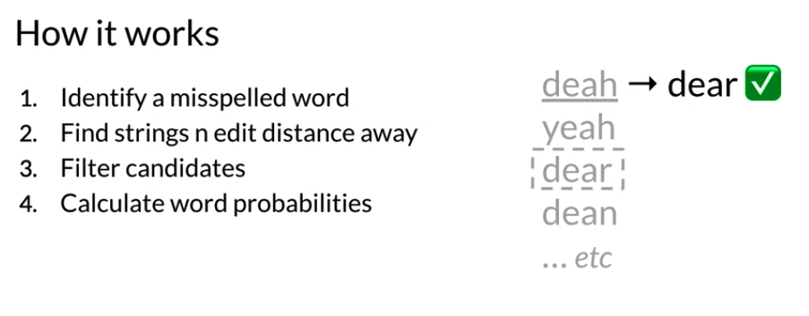
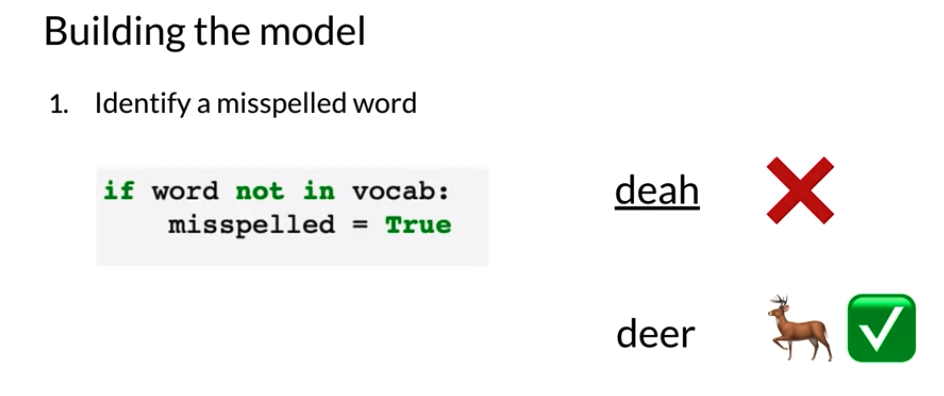
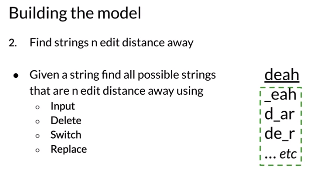
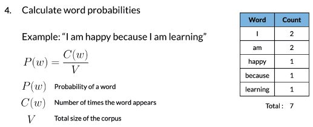
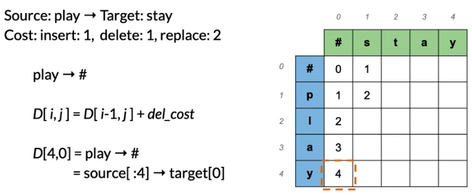
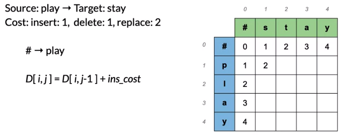
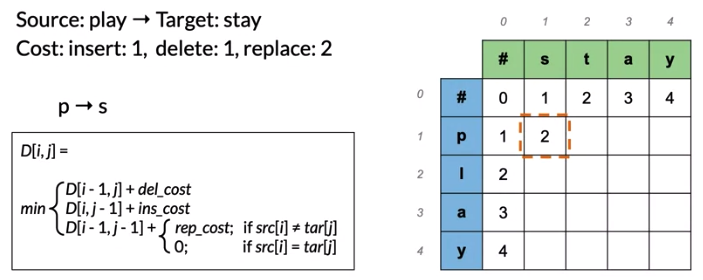

**NOTE:**

This repository is based on week 1 of **Natural Language Processing with Probabilistic Models** course on Coursera. Figures below credits goes to the course copy right.  

**Final Project Here**: [Click Link](https://github.com/KarenJF/deeplearing_nlp/blob/master/c2_nlp_with_probabilistic_models/week1/assignment1/C2_W1_Assignment.ipynb)

## Part 1: How to build a simple Autocorrect System
In this folder, I built a simple but still good enough autocorrect system to correct misspelled words. 

### What is Autocorrect: 
It’s an application that changes misspelled words into the correct ones. 

### High-level Summary steps to build a autocorrect system

  

### Steps to build a simple Autocorrect System 
1. Identify a misspelled word. 
One way to identify misspelled words is to check the word in a dictionary. If the word is not found, it’s probably a misspelled word. 

  

2. Find strings any n edit distances away (1,2,3 etc). The goal is to create a list of candidate words for replacement for the misspelled word. The intuition is that if a string is one edit distance away from the string that you typed, it's more similar to your string compared to a string that is two edit distances away. 
    - Edit is a type of operation to perform on a string to change it into another string.
    - Edit distance counts the number of these operations. For example, n-edit distance tells you how many operations away from one string to another. Some common edit operations are: 
        - Insert (add a letter): to -> top 
        - Delete (remove a letter): rat -> at
        - Switch (swap 2 adjacent letters, but not include swap letters that’s 2 steps or further from each other): eta -> eat
        - Replace (change 1 letter to another): jaw -> jar
    - For autocorrect problems, it’s usually 1 to 3 edit away.  

 Figure 2 

3. Filter the strings for real words that are spelled correctly. 
    - Compare the string candidates from step 2 with a known dictionary. If the string is not found, remove them. 
    - Then you’re left with a list of actual words only. 

4. Calculate word probabilities, which tell you how likely each word is to appear in this context and choose the most likely candidate to be the replacement.
    - Count the total number of words in the corpus
    - Count the number of times the word appears
    - The probability of a word in the sentence is then equal to the number of times that word appears in the corpus / total number of words in the corpus. 
    - For all the final candidates from step 3, we find the word candidate with the highest probability and choose that word as the replacement for the misspelled word. 

 Figure 3 

## Part 2: Minimum Edit Distance
### What is Minimum edit Distance and what it used for?
 - Minimum edit distance is to evaluate how similar two words, strings or even whole documents are. 
 - For given strings, the minimum edit distance is the lowest number of operations needed to transform one string into the other. 
 - Application: spelling correction, document similarity, machine translation, DNA sequencing and more. 

### How to calculate minimum edit distance? Brute Force method
We use 3 types of edit operations to calculate the minimum edit distance. 
 - Insert (add a letter), edit cost = 1
 - Delete (remove a letter), edit cost = 1
 - Replace (change 1 letter to another), edit cost = 2

We then sum the total operations needed to change a string to another, and that’s the minimum edit distance. However, if you do it one character to another, for a longer string, it will take lots of computational resources. Therefore, usually, we can use dynamic programming for this problem. 

### Algorithm: Dynamic Programming for calculating minimum edit distance. 
Example: 
- Source: play -> Target: stay
- Cost: insert = 1, delete = 1, replace = 2

Observe the following steps:
- Fill up the first column of the matrix

 

- Fill up the first row of the matrix

 

- The general term is as follow: 

 

