# Part of Speech Tagging 

### NOTE:

This repository is based on week 2 of Natural Language Processing with Probabilistic Models course on Coursera. Images below credits goes to the course copy right.

Final Project Here: [Click Link](https://github.com/KarenJF/deeplearing_nlp/blob/master/c2_nlp_with_probabilistic_models/week2/assignment2/C2_W2_Assignment.ipynb)

## Outline: 
- What is part of speech tagging (POS)?
- Markov Chains
- Hidden Markov Models
- Viterbi Algorithm

## Part 1: What is Parts of Speech (POS)?
Part-of-speech refers to the category of words or the lexical terms in the language. Examples of these lexical terms in the English language would be noun, verb, adjective, adverb, pronoun, preposition, etc. 

The **process** of assigning these tags to the words of a sentence or your corpus is referred to as parts of speech tagging, or **POS tagging** for short. Because POS tags describe the characteristics structure of lexical terms in a sentence or text, you can use it to make assumptions about the semantics. 

## Part 2: Markov Chains
The idea is that the likelihood of the next word's parts of speech tag in a sentence tends to depend on the parts of speech tag of the previous word. This is also known as part of speech dependencies. 

    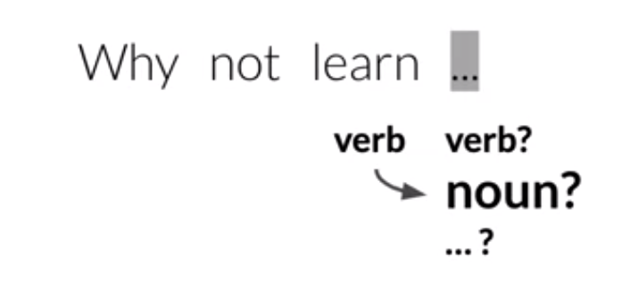 

### What are Markov chains?
- They're a type of stochastic model that describes a sequence of possible events. 
- To get the probability for each event, it needs only the states of the previous events. 
- The word stochastic just means random or randomness. So a stochastic model incorporates and models processes does have a random component to them. 
- A Markov chain can be depicted as a directed graph. 
- The circles of the graph represent states of our model. A state refers to a certain condition of the present moment. 

    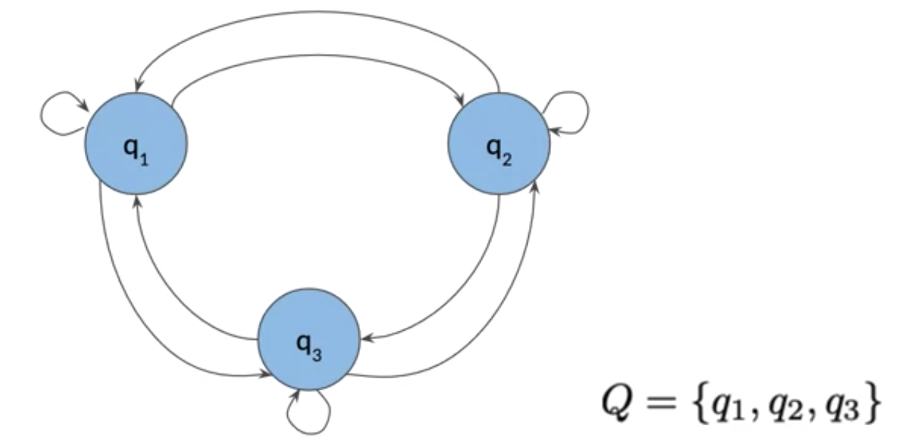 

## Part 3: Markov Chains and POS Tags
In NLP, we can think of POS tags as **States** in the Markov chains model. The edges of the graph have weights or transition probabilities associated with them which define the probability of going from one state to another. 
- Markov Property, which states that the probability of the next event only depends on the current events. 
- The Markov property helps keep the model simple by saying all you need to determine the next state is the current states. It doesn’t need information from any of the previous states. 

### Transition Matrix
- A transition matrix is a table equivalent, but more compact representation of a Markov chain model. 
- It stores the states and transition probabilities. 
- A transition matrix is an n by n matrix with n being the number of states in the graph. 
- The row represents the current state POS, the columns represent the possible future states that might come next. 
- Each row in the matrix represents transition probabilities of one state to all other states.
- For a given state, the sum of these transition probabilities should always be one. In other words, in a transition matrix, all of the transition probabilities in each row should add up to one. 

    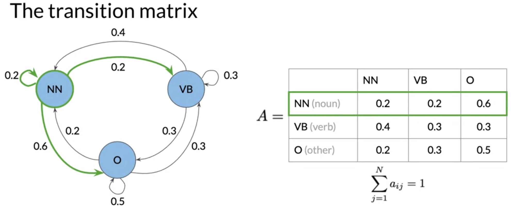 

In the current setup, it doesn’t handle cases when there are no previous words as in the case when beginning a sentence. To handle this, we can include an initial state. Then the transition matrix has dimension of n plus 1 by n. for example see below: 

    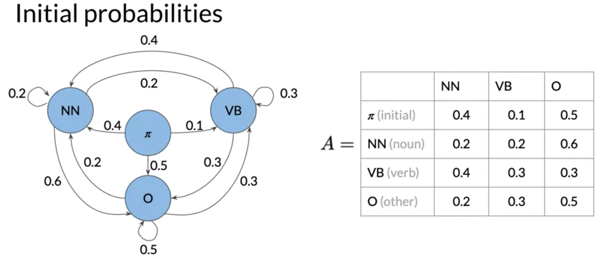 

### Summary: 
- Markov chains consists of a set q of n states p1 all the way to qn. 
- The transition matrix a has dimensions n plus 1 by n with the initial probabilities in the first row.

## Part 4: Hidden Markov Models
### Hidden Markov Model 
Hidden Markov model implies the states are hidden or not directly observable. In this case, the hidden states are part of speech of the word.

### Emission Probabilities
In addition to the transition probabilities in Markov chains model, the hidden markov model has additional probabilities known as **emission probabilities**.
- Emission probabilities describe the transition probability from the hidden parts of speech hidden state to the words of your corpus. 
- Each row is designated for one of the hidden states. A column is designated for each of the observables, or words. 
- Each row sums up to 1. 

    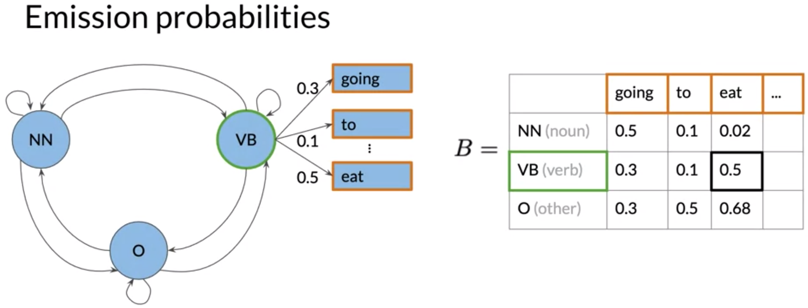 

### Summary for hidden Markov models: 
- They consist of a set of N states, Q
- The transition matrix A has dimension N by N
- The emission matrix B has dimension N by V
- N stands for number of tags, V stands for number of words

## Part 5: Calculating Probabilities
### Prepare the corpus
In order to be able to calculate the correct transition probabilities, we need to do some preparation to the corpus, such as: 
- Add the start token to each line or sentence in order to be able to calculate the initial probabilities. 
- Transform all words in the corpus to lowercase, so the model becomes case insensitive. 
- Take out some punctuations, special characters that don't have important meanings, stop words etc. 

### Transition probabilities
- To calculate the transition probabilities, you actually only use the parts of speech tags from your training corpus.
- The transition probabilities with smoothing = $$ P(t_i | t_{i-1}) = \frac{C(t_{i-1}, t_{i}) + \alpha }{C(t_{i-1}) +\alpha * N}$$

For example: 

    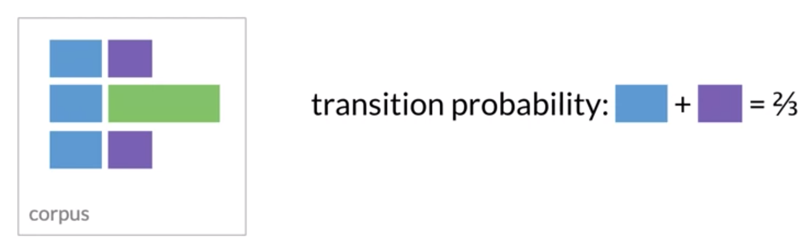 

### Populating the transition matrix
- The rows in the matrix represent the current states, 
- The columns represent the next states. 
- The values represent the transition probabilities of going from the current state to the next state. The states for this use case are the parts of speech tags. 

    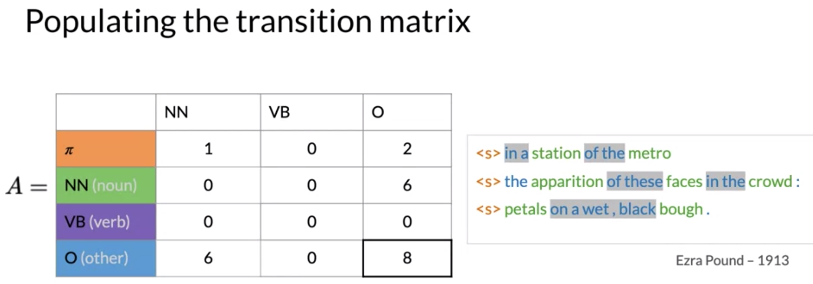 

**Caution**, here are two problems before we apply the formula to calculate the transition matrix: 
- One is that the row sum of the VB tag is zero, which would lead to a division by zero using this formula. 
- The other is that a lot of entries in the transition matrix are zero, meaning that these transitions will have probability zero. This won't work if you want the model to generalize to other equals, which might actually contain verbs.

To handle this, we can do **smoothing**, which is to add a small value epsilon to each of the accounts in the numerator, and add N times epsilon to the divisor such that the row sum still adds up to one. 

    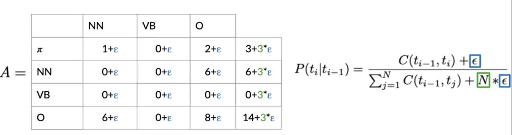 

However, in real word example, you might not want to apply smoothing to the initial probabilities in the first row of the transition matrix. That’s because if you apply smoothing to that row by adding a small value to possibly zero valued entries, you’ll effectively allow a sentence to start with any parts of speech tag, including punctuation. 

### Populating the Emission Matrix
- Emission probabilities describe the transition probability from the hidden parts of speech hidden state to the words of your corpus.
- Emission probabilities with smoothing = $$ P(w_i | t_i) = \frac{C(t_{i}, word_{i}) + \alpha }{C(t_{i}) +\alpha * N}$$

Example: 

    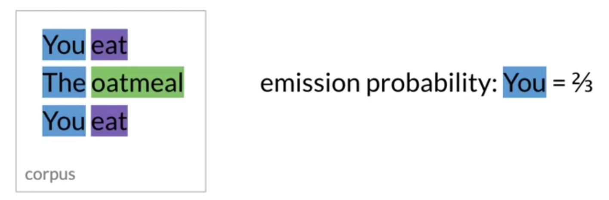 

## Part 6: The Viterbi Algorithm
Given a sentence, we can use Viterbi algorithm to compute the most likely sequence of parts of speech tags. 

### Viterbi algorithm overview - a graph algorithm
With a leading start token, you want to find the sequence of hidden states or parts of speech tags that have the highest probability for this sequence.

    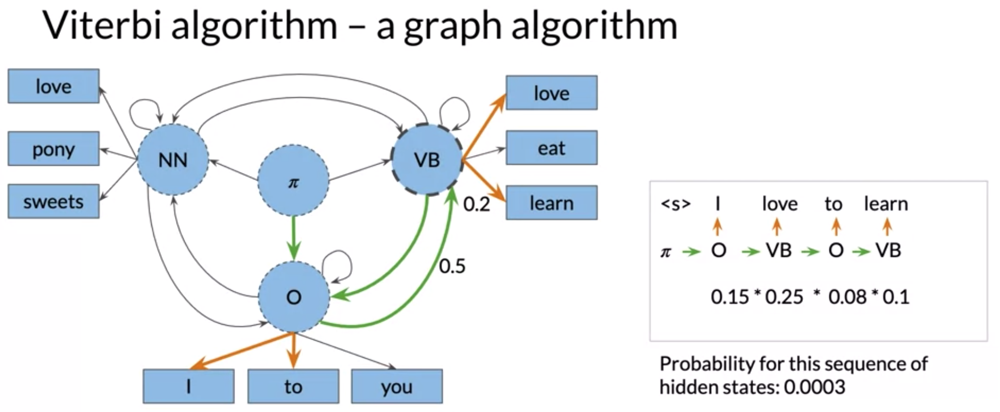 

The Viterbi algorithm computes all the possible paths for a given sentence in order to find the most likely sequence of hidden states. It uses the matrix representation of the hidden Markov models. The algorithm can be split into 3 steps: 
- Initialization step
- Forward pass
- Backward pass

It uses the transition probabilities and emission probabilities from the hidden Markov models to calculate two matrices. The matrix C (best_probs) holds the intermediate optimal probabilities and matrix D (best_paths), the indices of the visited states. 
- These two matrices have n rows, where n is the number of parts of speech tags or hidden states in the model. 
- And K columns, where k is the number of words in the given sequence. 

    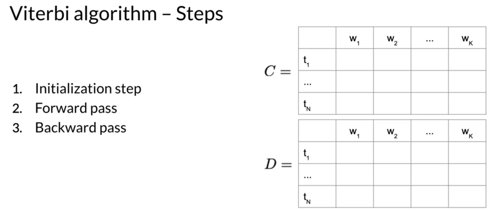 

### Viterbi Initialization 
In the initialization step, the first column in C and D matrix is populated. 

**First column in C:**
- The first column of C represents the probability of transition from start state to the first tag ti and the word w1. Meaning we are trying to go from tag 1 to the word W1.
- Formula: $$ c_{i,1} = \pi * b_{i, cindex(w_{1})}
        = a_{1,i}*b_{i,cindex(w_{1})}$$
- where $a_{1,i}$ is the transition probability from strat state to i
- where $ b_{i, cindex(w_{1})}$ is the emission probability from tag i to word 1

    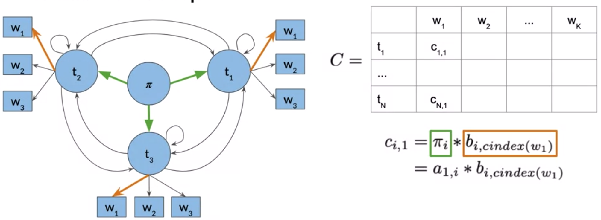 

**First column in D matrix:** 
- In the D matrix, you store the labels that represent the different states you're traversing when finding the most likely sequence of parts of speech tags for the given sequence of words, W1 all the way to Wk. 
- In the first column, you simply set all entries to zero, as there are no proceeding parts of speech tags we have traversed. 

    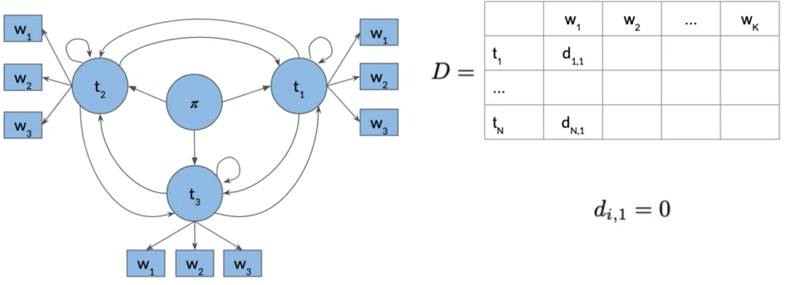 

### Viterbi Forward Pass
After initialized the matrices C and D, all the remaining entries in the two matrices, C and D, are populated column by column during the forward pass.

**C matrix formula:** 
$$ C_{i,j} =max c_{k, j-1} * a_{k,i} * b_{i, cindex(w_{j})}$$
- $b_{i, cindex(w_{j})}$ is the emission probability from tag i to word j
- $a_{k,i}$ is the transition probability from tag k to current tag i
- $c_{k, j-1}$ is the probability of the preceding path you’ve traversed. We then choose the k which maximizes the entire formula. 

**D matrix formula:** 
$$ d_{i, j}=argmax c_{k, j-1}* a_{k,i}*b_{i, cindex(w_{j})}$$
- which simply save the k, which maximized the entry in each $c_{i,j}$ 

    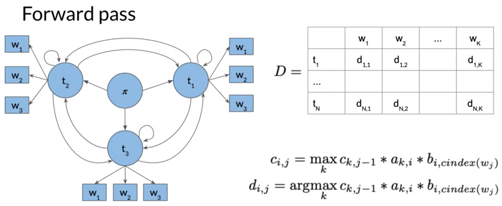 

### Viterbi Backward Pass
Use the C and D matrix from Forward Pass to create a path, so that we can assign a parts of speech tag to every word. 

The D matrix represents the sequence of hidden states that most likely generated our sequence, word one all the way to word K. The backward pass helps retrieve the most likely sequence of parts of speech tags for the given sequence of words. 

Steps: 
- Calculate the index of the entry $C_{i, k}$ with the highest probability in the last column of C. The probability at this index is the probability of the most likely sequence of hidden states, generating the given sequence of words.
- Then we use this index s to traverse backwards through the matrix D, to reconstruct the sequence of parts of speech tags.

Example: 
- Let’s say in the last column of matrix C, the highest probability is $t_{1}$

    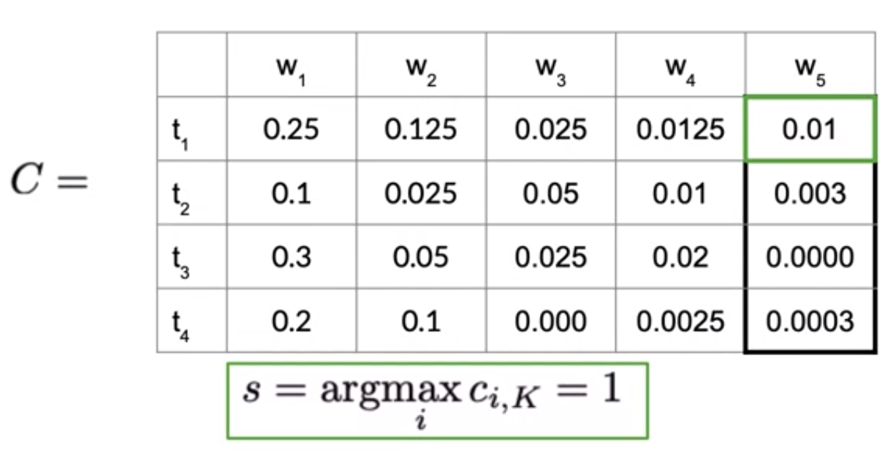 

- Then we go to matrix D, we can find the following best path travels backward, until we arrive at the start of the token. The path we recover from the backward pass is the sequence of parts of speech tags with the highest probability.

    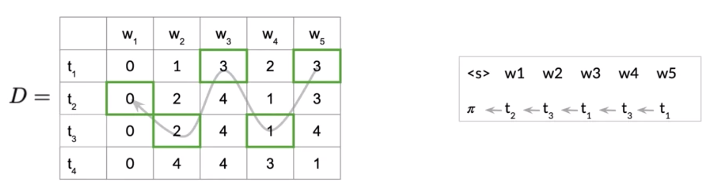 

### Implementation notes
- Be careful of the index in the matrix. In Python, index starts with 0. 
- Use log probabilities instead of product, because when we multiply many very small numbers like probabilities, this will lead to numerical issues. 
- Change $$c_{i,j} = max c_{k, j-1} * a_{k,i} * b_{i, cindex(w_{j})} $$ to $$log(c_{i,j})=max log(c_{k, j-1})+log( a_{k,i})+log(b_{i, cindex(w_{j})})$$

    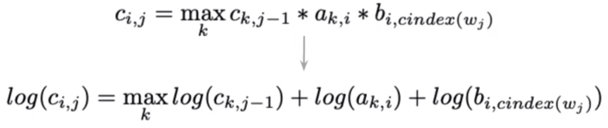 

